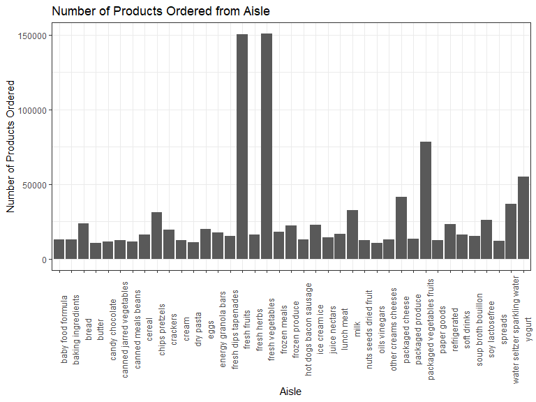
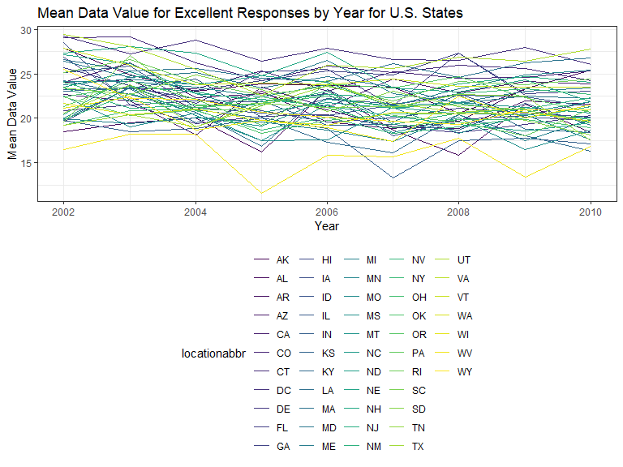
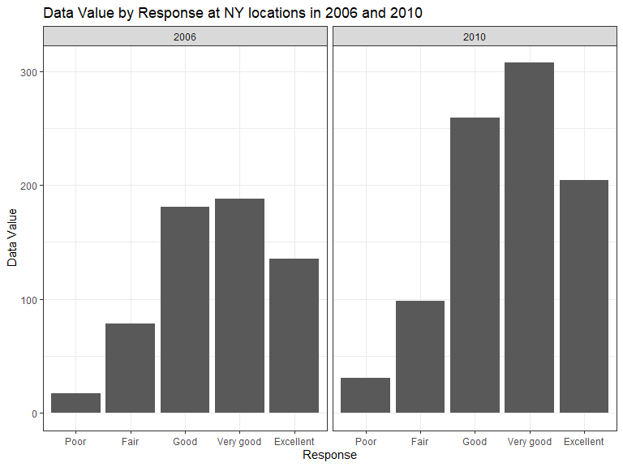
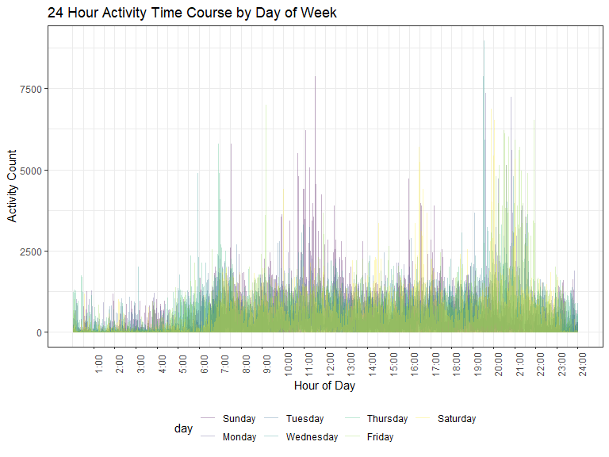

Homework 3
================
Sarah McLarnan
2019-10-07

### Problem 1

``` r
library(p8105.datasets)
data("instacart")
```

The `instacart` data set has 1384617 observations of 15 metrics. Each row corresponds to a single item in an order. The columns contain information including the item ordered (`product_id`, `product_name`), the department (`department_id`, `department`) and aisle (`aisle_id`, `aisle`) it is from, the day of the week (`order_dow`) and time (`order_hour_of_day`) it was ordered, the order in which the item was added to the order (`add_to_cart_order`) in addition to other metrics. For example the first item in the table is Bulgarian Yogurt from the yogurt aisle in the dairy and eggs department. The item was ordered at 10 a.m. on a Wednesday, it was the first item the shopper added to their order and it had been 9 days since that shopper's previous order.

``` r
n_distinct(pull(instacart, aisle_id))
```

    ## [1] 134

``` r
instacart %>%
  group_by(aisle) %>%
  summarize(n = n()) %>%
  mutate(aisle_rank = rank(desc(n))) %>%
  filter(aisle_rank <= 3)
```

    ## # A tibble: 3 x 3
    ##   aisle                           n aisle_rank
    ##   <chr>                       <int>      <dbl>
    ## 1 fresh fruits               150473          2
    ## 2 fresh vegetables           150609          1
    ## 3 packaged vegetables fruits  78493          3

There are 134 aisles. The top three aisles with the most products ordered from are fresh vegetables, fresh fruits, and packaged vegetables and fruits.

``` r
instacart %>%
  group_by(aisle) %>%
  summarize(n = n()) %>%
  filter(n > 10000) %>%
  ggplot(aes(x = aisle, y = n)) + 
  geom_col() +
  theme(axis.text.x = element_text(angle = 90)) +
  labs(x = "Aisle", y = "Number of Products Ordered", title = "Number of Products Ordered from Aisle")
```



The graph of number of products ordered from each aisle shows the three aisles with the most products ordered were fresh fruits (~150,000) and fresh vegetables (~150,000) and packged fruits and vegetables (~77,000)

``` r
instacart %>%
  group_by(aisle, product_name) %>%
  summarize(n = n()) %>%
  mutate(product_rank = rank(desc(n))) %>%
  filter(product_rank <= 3) %>%
  filter(aisle == "baking ingredients" | aisle == "dog food care" | aisle == "packaged vegetables fruits") %>%
  arrange(aisle, product_rank) %>%
  knitr::kable()
```

| aisle                      | product\_name                                 |     n|  product\_rank|
|:---------------------------|:----------------------------------------------|-----:|--------------:|
| baking ingredients         | Light Brown Sugar                             |   499|              1|
| baking ingredients         | Pure Baking Soda                              |   387|              2|
| baking ingredients         | Cane Sugar                                    |   336|              3|
| dog food care              | Snack Sticks Chicken & Rice Recipe Dog Treats |    30|              1|
| dog food care              | Organix Chicken & Brown Rice Recipe           |    28|              2|
| dog food care              | Small Dog Biscuits                            |    26|              3|
| packaged vegetables fruits | Organic Baby Spinach                          |  9784|              1|
| packaged vegetables fruits | Organic Raspberries                           |  5546|              2|
| packaged vegetables fruits | Organic Blueberries                           |  4966|              3|

The top three products ordered in baking ingrendients were light brown sugar, pure baking soda, and cane sugar. In dog food care the top three products were snack sticks chicken and rice recipe dog treats, organix chicken and brown rice recipe and small dog biscuits. The top three products ordred in packaged vegetables and fruits were organic baby spinach, organic raspberries, and organic blueberries.

``` r
instacart %>%
  filter(product_name == "Coffee Ice Cream" | product_name == "Pink Lady Apples") %>%
  group_by (order_dow, product_name) %>%
  summarize (mean_time = mean(order_hour_of_day)) %>%
  pivot_wider (names_from = order_dow, values_from = mean_time) %>%
  knitr::kable()
```

| product\_name    |         0|         1|         2|         3|         4|         5|         6|
|:-----------------|---------:|---------:|---------:|---------:|---------:|---------:|---------:|
| Coffee Ice Cream |  13.77419|  14.31579|  15.38095|  15.31818|  15.21739|  12.26316|  13.83333|
| Pink Lady Apples |  13.44118|  11.36000|  11.70213|  14.25000|  11.55172|  12.78431|  11.93750|

The table of average time that each pink lady apples and coffe ice cream were ordered show that coffee ice cream is generally ordered later in the day than pink lady apples. Both products were ordered, on average, between late afternoon and mid afternoon.

### Problem 2

``` r
data("brfss_smart2010")

brfss_smart2010 = 
  brfss_smart2010 %>%
  janitor::clean_names() %>%
  filter(topic == "Overall Health") %>%
  filter(response == "Excellent" | response == "Very good" | response == "Good" | response == "Fair" | response == "Poor") %>%
  mutate(response = factor(response), 
         response = forcats::fct_relevel(response, c("Poor", "Fair", "Good", "Very good", "Excellent"))) 
```

``` r
brfss_smart2010 %>%
  filter(year == "2002") %>%
  group_by(locationabbr) %>%
  summarize(unique_location = length(unique(locationdesc))) %>%
  filter(unique_location >= 7)
```

    ## # A tibble: 6 x 2
    ##   locationabbr unique_location
    ##   <chr>                  <int>
    ## 1 CT                         7
    ## 2 FL                         7
    ## 3 MA                         8
    ## 4 NC                         7
    ## 5 NJ                         8
    ## 6 PA                        10

``` r
brfss_smart2010 %>%
  filter(year == "2010") %>%
  group_by(locationabbr) %>%
  summarize(unique_location = length(unique(locationdesc))) %>%
  filter(unique_location >= 7)
```

    ## # A tibble: 14 x 2
    ##    locationabbr unique_location
    ##    <chr>                  <int>
    ##  1 CA                        12
    ##  2 CO                         7
    ##  3 FL                        41
    ##  4 MA                         9
    ##  5 MD                        12
    ##  6 NC                        12
    ##  7 NE                        10
    ##  8 NJ                        19
    ##  9 NY                         9
    ## 10 OH                         8
    ## 11 PA                         7
    ## 12 SC                         7
    ## 13 TX                        16
    ## 14 WA                        10

There were six states with more than 7 unique locations in 2002 and 14 states with more than 7 unique locations in 2010.

``` r
brfss_smart2010 %>%
  filter(response == "Excellent") %>%
  group_by(locationabbr, year) %>%
  summarize(data_value_mean = mean(data_value)) %>%
  ggplot(aes(x = year, y = data_value_mean, group = locationabbr, color = locationabbr)) +
  geom_line() +
  labs(
        x = "Year", 
        y = "Mean Data Value", 
        title = "Mean Data Value for Excellent Responses by Year for U.S. States"
      )
```



The plot generated indicates the majority of states have relatively similar mean data values each year with a few outliers on the low end.

``` r
brfss_smart2010 %>%
  filter(locationabbr == "NY", year == "2006" | year == "2010") %>%
  ggplot(aes(x = response, y = data_value)) +
        geom_col() +
        facet_grid(~year) +
        labs(x = "Response", y = "Data Value", title = "Data Value by Response at NY locations in 2006 and 2010")
```



The paneled graph of data value by response in 2006 and 2010 show that the most responses were "very good" for each year and "poor" had the fewest responses. 2010 had more responses in each category than 2006.

### Problem 3

``` r
accel_data = read_csv("./data/accel_data.csv") 
```

    ## Parsed with column specification:
    ## cols(
    ##   .default = col_double(),
    ##   day = col_character()
    ## )

    ## See spec(...) for full column specifications.

``` r
accel_data = pivot_longer(accel_data, activity.1:activity.1440, names_to = "activity_minute", values_to = "activity_count") %>%
  separate(activity_minute, into = c("activity", "minute")) %>%
  select(-activity) %>%
  mutate(
    minute = as.numeric(minute),
    day = as.factor(day),
    day = forcats::fct_relevel(day, c("Sunday", "Monday", "Tuesday", "Wednesday", "Thursday", "Friday", "Saturday")),
    day_type  = if_else(day == "Saturday" | day == "Sunday", "weekend", "weekday"))
```

The cleaned problem 3 data set has 50400 observations of 6 variables. The columns include data on week, day number, day of the week, minute of the day, activity count and day of the week type.

``` r
accel_data %>%
  group_by(day_id) %>%
  summarize(total_activity = sum(activity_count)) %>%
  knitr::kable()
```

|  day\_id|  total\_activity|
|--------:|----------------:|
|        1|        480542.62|
|        2|         78828.07|
|        3|        376254.00|
|        4|        631105.00|
|        5|        355923.64|
|        6|        307094.24|
|        7|        340115.01|
|        8|        568839.00|
|        9|        295431.00|
|       10|        607175.00|
|       11|        422018.00|
|       12|        474048.00|
|       13|        423245.00|
|       14|        440962.00|
|       15|        467420.00|
|       16|        685910.00|
|       17|        382928.00|
|       18|        467052.00|
|       19|        371230.00|
|       20|        381507.00|
|       21|        468869.00|
|       22|        154049.00|
|       23|        409450.00|
|       24|          1440.00|
|       25|        260617.00|
|       26|        340291.00|
|       27|        319568.00|
|       28|        434460.00|
|       29|        620860.00|
|       30|        389080.00|
|       31|          1440.00|
|       32|        138421.00|
|       33|        549658.00|
|       34|        367824.00|
|       35|        445366.00|

The table of total activity per day shows the range of activity counts from approximately 8,000 to 68,000. Two days have values of 1,440 indicating one activity count per minute which is presumably some sort of product error or the individual did not wear the accelerometer that day.

``` r
accel_data %>%
  ggplot(aes(x = minute, y = activity_count, color = day)) + 
  geom_line(alpha = .3) +
  scale_x_continuous(
    breaks = c(60, 120, 180, 240, 300, 360, 420, 480, 540, 600, 660, 720, 780, 840, 900, 960, 1020, 1080, 1140, 1200, 1260, 1320, 1380, 1440), 
    labels = c("1:00", "2:00", "3:00", "4:00", "5:00", "6:00", "7:00", "8:00", "9:00", "10:00", "11:00", "12:00", "13:00", "14:00", "15:00", "16:00", "17:00", "18:00", "19:00", "20:00", "21:00", "22:00", "23:00", "24:00")) +
  labs(x = "Hour of Day", y = "Activity Count", title = "24 Hour Activity Time Course by Day of Week") +
  theme(axis.text.x = element_text(angle = 90))
```



The 24 hour activity time course by day of week shows pattern of more activity during the day and less at night. There are typically spikes in activity around 7:00 - 8:00 a.m., 11-noon and 7:00-10:00 p.m..
